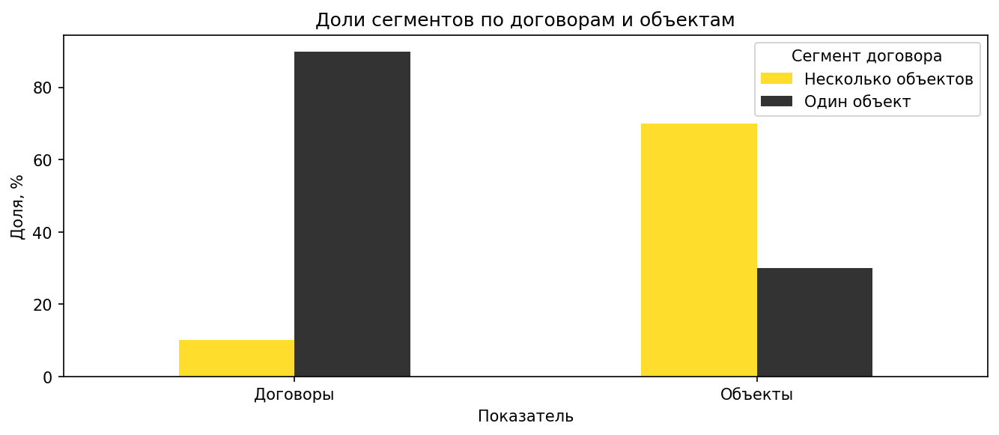
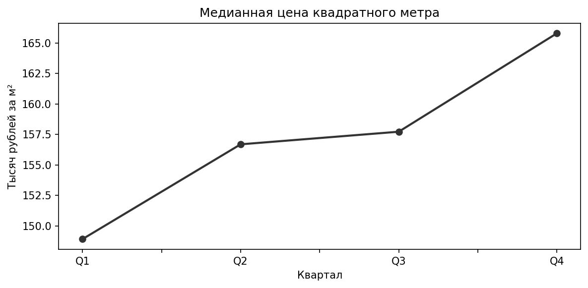
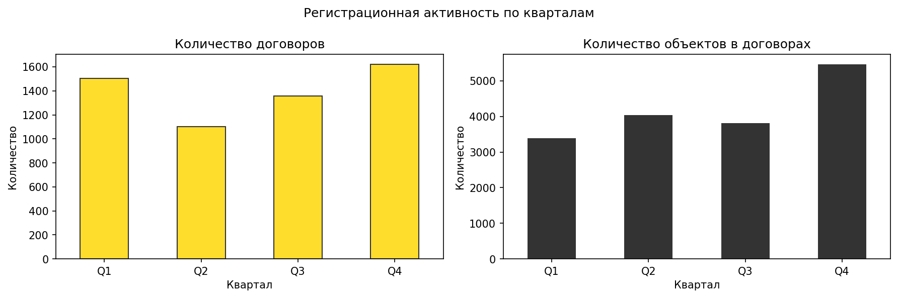
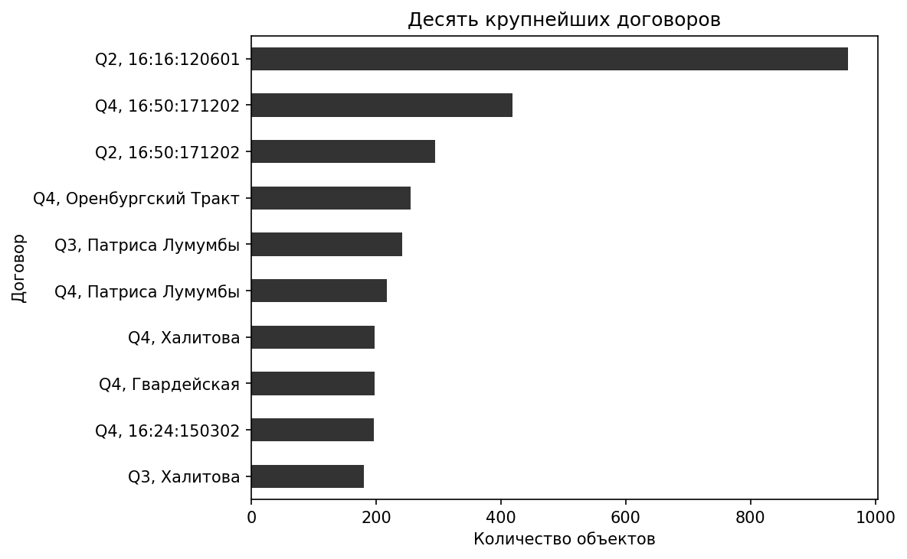
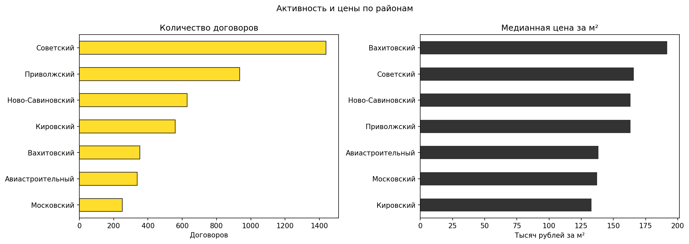
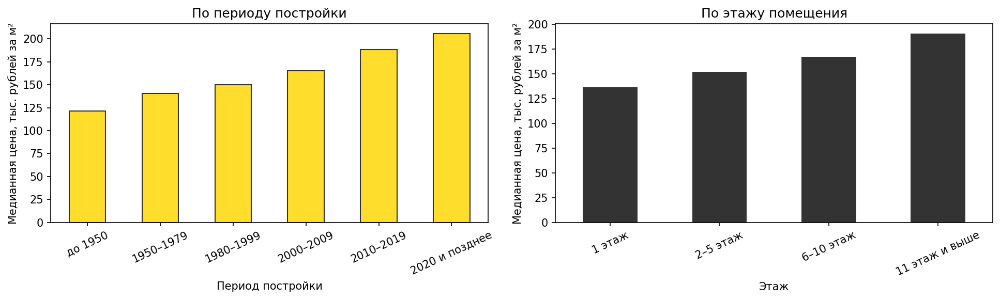
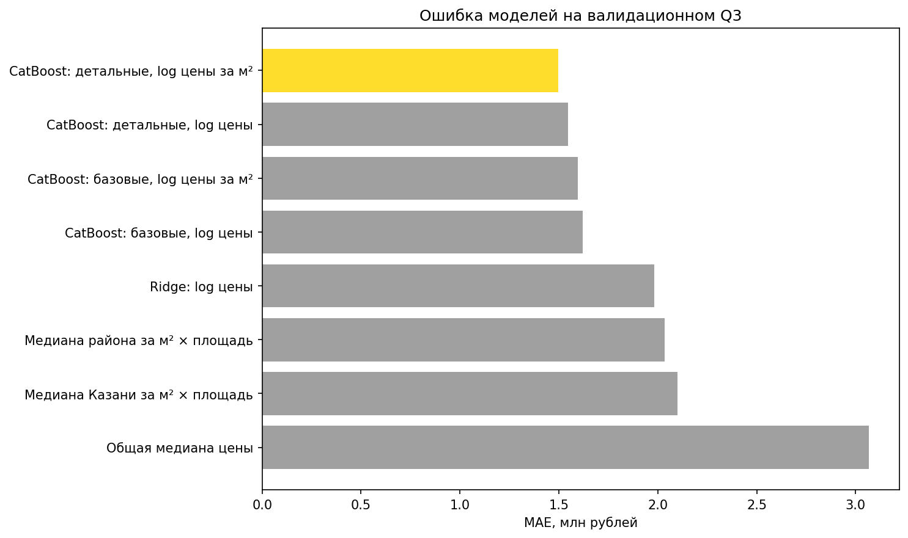
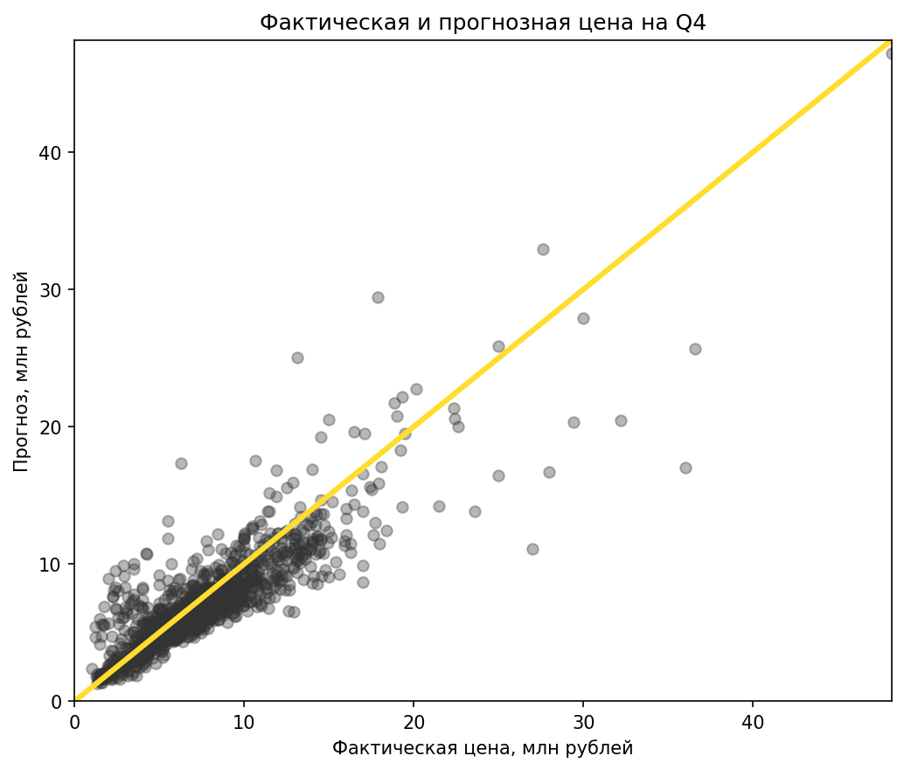
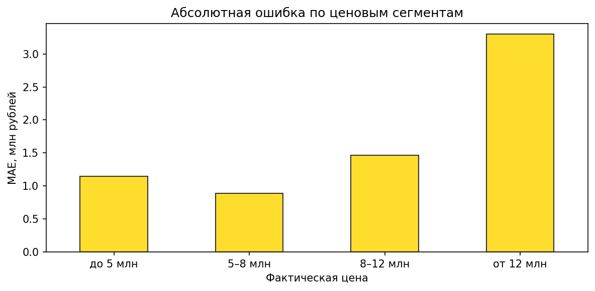
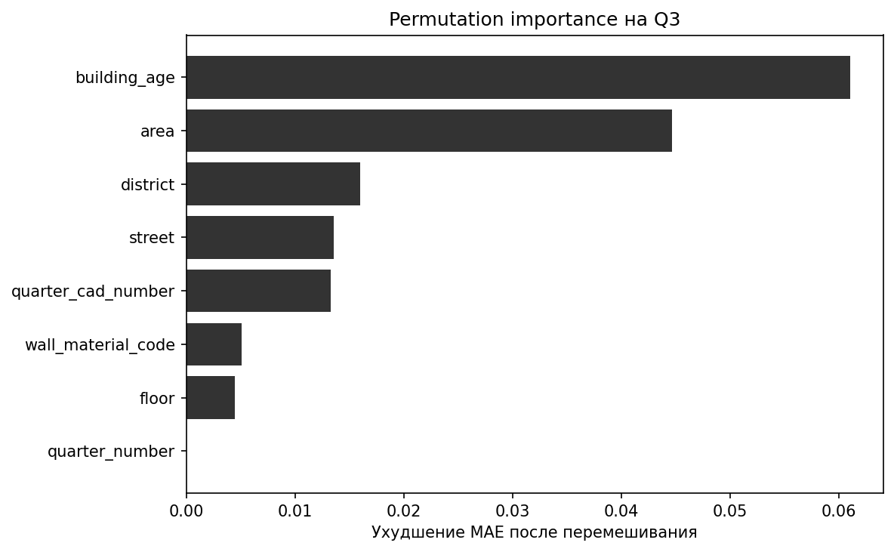

# Анализ рынка жилой недвижимости Казани в 2025 году

Исследование зарегистрированных договоров с жилыми помещениями на основе открытых данных Росреестра.

> **5 584 договора · 16 693 объекта недвижимости · 4 квартала · 7 административных районов**

Цель проекта — посмотреть на рынок глазами человека, который выбирает жильё: оценить активность, динамику цен, различия между районами и связь стоимости с характеристиками объекта. После исследовательского анализа построена модель, которая оценивает ожидаемую зарегистрированную цену одиночного ДКП и показывает диапазон неопределённости. Одновременно данные позволяют увидеть менее очевидную часть рынка — договоры, в которых регистрируются десятки или сотни объектов.

Одно из главных наблюдений: рынок выглядит совершенно по-разному в зависимости от единицы измерения. Многообъектные сделки составляют лишь 10,1% договоров, но включают 69,9% зарегистрированных объектов. Поэтому в анализе отдельно рассматриваются активность обычных одиночных сделок и влияние крупных регистраций на общий объём рынка.

## Коротко о результатах

- Многообъектные сделки составляют только **10,1% договоров**, но включают **69,9% всех объектов**.
- Всего **10 крупнейших договоров** содержат 3 156 объектов — **18,9% годового объёма**.
- Медианная цена квадратного метра среди одиночных договоров выросла со **148,9 тыс. рублей в Q1** до **165,8 тыс. рублей в Q4**.
- Среди договоров с известным районом самая высокая медианная цена за м² наблюдается в Вахитовском районе — **191,7 тыс. рублей**, самая низкая в Кировском — **133,0 тыс. рублей**.
- Исключение 146 наблюдений с ценовым флагом изменяет общую медиану менее чем на **1%**: основной ценовой результат устойчив к выбранным диагностическим порогам.
- На нетронутом Q4 модель CatBoost достигает **MAE 1,35 млн рублей** и **R² 0,74**, снижая MAE на **27,3%** относительно районного baseline.
- **69,1% прогнозов** отличаются от зарегистрированной цены не более чем на 20%; эмпирический 80%-й интервал покрывает **83,7%** тестовых наблюдений.



Один график показывает, почему для анализа рынка недостаточно посчитать строки: небольшое число крупных договоров формирует большую часть зарегистрированного объёма объектов.



Рост квартальной медианы является описанием наблюдаемой выборки, а не очищенным индексом цен: состав зарегистрированных объектов мог меняться между кварталами.

## Как строился анализ

### 1. От общероссийских файлов к выборке Казани

Четыре исходных квартальных файла содержат около 2,67 млн строк и занимают сотни мегабайт. Чтобы не загружать их одновременно в оперативную память, данные читаются блоками по 100 000 строк.

В каждом блоке остаются записи, которые соответствуют трём условиям:

- ОКАТО начинается с `92401` — Казань;
- вид объекта `002001003000` — помещение;
- назначение `206002000000` — жилое помещение.

Так формируется локальный набор из 5 584 договоров. Исходные данные опубликованы Росреестром; ссылки на государственные источники: [Росреестр](https://rosreestr.gov.ru/) и [Портал открытых данных РФ](https://data.gov.ru/).

### 2. Сначала смысл данных, потом очистка

Первоначально большие значения `number` могли выглядеть как повторяющиеся строки. Проверка семантики показала, что это количество объектов внутри одного договора. Простое раскрытие таких строк или деление цены на количество объектов создало бы несуществующие индивидуальные цены.

Поэтому в проекте используются три представления данных:

- **все договоры** — для оценки регистрационной активности;
- **сумма `property_count`** — для оценки количества объектов в договорах;
- **договоры с одним объектом** — для анализа индивидуальной цены и цены квадратного метра.

Многообъектные договоры не удаляются как выбросы: они образуют отдельный содержательный сегмент рынка.

### 3. Консервативная очистка

Очистка исправляет формат данных, не подменяя наблюдения предположениями:

- `number` переименован в `property_count`;
- числовые поля и даты приведены к аналитическим типам;
- исходные текстовые значения этажа сохранены в `floor_raw`;
- проверены пропуски, преобразование типов и повторяющиеся записи;
- удаляются только полные дубликаты — в наборе их не обнаружено;
- необычные цены получают флаг `needs_price_review`, но остаются в master-таблице;
- цена за м² рассчитывается только для договоров с одним объектом;
- административный район восстанавливается только по прямому соответствию ОКАТО.

ДКП и ДДУ сохраняются. Для ДДУ отсутствие года постройки, этажа или материала стен часто связано со строящимся объектом и не считается автоматической ошибкой.

## Что удалось узнать

### Договоры и реальный объём объектов

За 2025 год в выборке зарегистрировано 5 584 договора, включающих 16 693 объекта. Самым активным стал Q4: 1 622 договора и 5 468 объектов. При этом квартальная динамика числа объектов заметно сильнее зависит от крупных ДДУ, чем динамика числа договоров.

ДДУ составляют только 302 договора, но включают 11 050 объектов. В 89,4% договоров ДДУ зарегистрировано больше одного объекта, тогда как для ДКП эта доля составляет 5,5%.



### Концентрация крупных регистраций

Крупнейший договор включает 956 объектов — 5,7% всех объектов за год. На 25 крупнейших договоров приходится уже 29,8% годового объёма. Это означает, что всплеск числа объектов нельзя автоматически интерпретировать как аналогичный рост количества обычных покупателей.



### Районы Казани

Советский район лидирует по количеству договоров. Вахитовский отличается самой высокой медианной стоимостью квадратного метра, а Кировский — самой низкой среди размеченных районов.



Район удалось определить для 80,6% договоров. Оставшиеся 19,4% имеют только общий код Казани, поэтому районные результаты нельзя считать полным описанием всего городского рынка.

### Площадь и характеристики здания

Помещения площадью до 50 м² имеют наиболее высокую медианную цену квадратного метра — около 164–167 тыс. рублей. Для группы 50–70 м² медиана ниже и составляет 146,0 тыс. рублей.

В одиночных ДКП без ценового флага медианная цена за м² последовательно увеличивается от 121,2 тыс. рублей для домов до 1950 года до 205,9 тыс. рублей для домов 2020 года и новее. Аналогичная связь наблюдается с этажом, однако её нельзя считать самостоятельным эффектом: высокие этажи чаще встречаются в новых домах.



Полные таблицы, дополнительные графики и расчёты находятся в [ноутбуке исследовательского анализа](notebooks/04_exploratory_analysis.ipynb).

## Прогноз зарегистрированной цены

### Практическая постановка

Модель отвечает на ограниченный, но полезный вопрос: **какая зарегистрированная цена ожидается для жилого помещения, продаваемого одним объектом по ДКП, если известны его площадь, местоположение и характеристики здания?** Такой прогноз можно использовать как ориентир для первичной проверки цены, но не как профессиональную оценку рыночной стоимости.

Для моделирования отобраны 4 850 одиночных ДКП с положительными ценой и площадью и без ценового флага. Многообъектные договоры не подходят для этой задачи, поскольку в них известна только общая цена всех объектов. ДДУ остаются важной частью анализа активности рынка, но не включены в модель: в данных всего 32 одиночных ДДУ, а год постройки, этаж и материал стен для строящихся объектов часто отсутствуют.

### Метод

Чтобы не получить завышенную оценку качества из-за случайного перемешивания сделок разных периодов, использовано временное разбиение:

- **Q1–Q2 — 2 267 наблюдений:** обучение кандидатов;
- **Q3 — 1 170 наблюдений:** выбор постановки и числа итераций;
- **Q4 — 1 413 наблюдений:** единственная финальная проверка на будущем периоде.

Сравнивались три простых правила, Ridge-регрессия и четыре конфигурации CatBoost. Baseline-модели предсказывают общую медианную цену, городскую медиану за м² или медиану района за м², умноженную на площадь. Для CatBoost проверены базовый и детальный наборы признаков, а также две цели: логарифм полной цены и логарифм цены за м².

Финальная модель прогнозирует логарифм цены за м², после чего результат умножается на площадь. Она использует:

- площадь, возраст здания, этаж и номер квартала;
- административный район и материал стен;
- улицу и кадастровый квартал.

Цена сделки, фактическая цена за м², ценовой флаг и количество объектов не передаются модели. Категории обрабатываются CatBoost напрямую, а пропуски числовых признаков остаются явно неизвестными. Лучшая конфигурация выбрана только по MAE на Q3; после этого она переобучена на Q1–Q3 с зафиксированными 504 итерациями и проверена на Q4.



### Качество на будущем квартале

| Модель | MAE, млн ₽ | MdAPE | MAPE | R² | Ошибка ≤ 20% |
|---|---:|---:|---:|---:|---:|
| **CatBoost: детальные признаки, log цены за м²** | **1,35** | **13,6%** | **21,0%** | **0,74** | **69,1%** |
| Медиана района за м² × площадь | 1,86 | 19,1% | 27,8% | 0,50 | 52,4% |
| Медиана Казани за м² × площадь | 1,94 | 19,9% | 29,0% | 0,47 | 50,2% |

Основная метрика — MAE: она показывает среднюю абсолютную ошибку в понятных денежных единицах. MdAPE меньше чувствительна к нескольким дорогим объектам, а R² показывает, какую часть вариации цен модель объясняет относительно постоянного прогноза. На Q3 выигрыш выбранной модели относительно районного baseline составлял 26,4%, а на нетронутом Q4 — 27,3%, поэтому улучшение сохранилось при переходе к будущему периоду.



### Где прогнозу можно доверять меньше

Ошибки распределены неравномерно:

- в сегменте 5–8 млн рублей MAE составляет 0,89 млн, а в сегменте от 12 млн — 3,30 млн рублей;
- для улиц, встречавшихся в Q1–Q3, MAE равна 1,33 млн, для 41 новой улицы — 2,07 млн рублей;
- для известных кадастровых кварталов MAE равна 1,31 млн, для 45 новых кварталов — 2,66 млн рублей;
- наименьшая районная MAE наблюдается в Авиастроительном районе — 0,84 млн, наибольшая в Вахитовском — 1,98 млн рублей.

Размеры новых географических групп невелики, поэтому эти значения являются диагностикой обобщающей способности, а не устойчивым рейтингом районов или улиц.



Permutation importance на Q3 показывает, что наибольший вклад в прогноз вносят возраст здания и площадь. Далее следуют район, улица и кадастровый квартал. Номер квартала внутри одного года почти не улучшает прогноз. Это объясняет поведение модели, но не доказывает причинного влияния признаков на цену.



### Неопределённость прогноза

По остаткам Q3 построен общий эмпирический 80%-й интервал: точечная оценка умножается на коэффициенты от 0,759 до 1,349. На Q4 внутри него оказались 83,7% фактических цен, а медианная ширина составила 3,82 млн рублей.

Интервал полезнее одной цифры, но он одинаково масштабируется для всех объектов и не учитывает индивидуальный риск конкретного помещения. Поэтому его следует читать как ориентир типичной ошибки модели, а не как формальный доверительный интервал.

Все эксперименты, таблицы ошибок, расчёт интервала и пример функции оценки находятся в [ноутбуке моделирования](notebooks/05_price_modeling.ipynb).

## Ограничения

- В данных нет типа покупателя. Одиночные сделки используются только как приближение к обычным покупкам домохозяйств, а многообъектные — к оптовой или институциональной активности.
- Категория «жилое помещение» может включать не только квартиры, но и комнаты: отдельного надёжного признака в источнике нет.
- Для 19,4% договоров административный район неизвестен.
- Для многообъектных договоров `deal_price` является общей стоимостью договора. Поле `area` также не интерпретируется как площадь отдельной квартиры.
- Временная детализация ограничена кварталами; точная дата сделки отсутствует.
- Зарегистрированные цены не являются ценами объявлений. Полученные медианы описывают именно выборку зарегистрированных договоров.
- Наблюдаемые различия между районами, этажами и возрастом домов являются связями, а не доказанными причинными эффектами.
- Модель не видит число комнат, состояние ремонта, точный дом и координаты — важные факторы цены.
- Модель обучена только на одиночных ДКП 2025 года. Её качество нельзя автоматически переносить на ДДУ, пакетные договоры, другие города или периоды.
- Интервал неопределённости общий для всех объектов и не заменяет индивидуальную оценку недвижимости.

## Структура проекта

```text
Kazan-housing/
├── data/                              # исходные и созданные CSV, не публикуются в Git
├── notebooks/
│   ├── 01_data_preparation.ipynb      # извлечение Казани из квартальных файлов
│   ├── 02_data_quality_audit.ipynb    # количественный аудит качества
│   ├── 03_data_cleaning.ipynb         # очистка и аналитические признаки
│   ├── 04_exploratory_analysis.ipynb  # исследование рынка
│   └── 05_price_modeling.ipynb        # прогноз цены и анализ качества модели
├── reports/
│   └── figures/                       # графики для README и отчёта
├── src/                               # место для вынесения переиспользуемого кода
├── requirements.txt
└── README.md
```

Ноутбуки разделены по этапам, чтобы исходные данные, диагностика, решения об очистке и итоговый анализ не смешивались в одном файле.

## Как воспроизвести проект

1. Создать окружение и установить зависимости:

```powershell
python -m venv .venv
.\.venv\Scripts\Activate.ps1
pip install -r requirements.txt
```

2. Поместить четыре квартальных файла Росреестра за 2025 год в папку `data/`. Ожидаемый шаблон имени: `dataset_СДЕЛКИ_*_q_1.csv` — `dataset_СДЕЛКИ_*_q_4.csv`.

3. Запустить Jupyter:

```powershell
jupyter notebook
```

4. Последовательно выполнить ноутбуки `01` → `02` → `03` → `04` → `05`.

Исходные и промежуточные CSV намеренно исключены из Git из-за размера и условий распространения. Все преобразования воспроизводятся ноутбуками.

## Технологии

Python · pandas · NumPy · Matplotlib · scikit-learn · CatBoost · Jupyter Notebook

## Что демонстрирует проект

- обработку нескольких миллионов строк с ограничением памяти;
- проверку семантики полей до построения метрик;
- аудит качества и обоснованные решения об очистке;
- разделение бизнес-показателей с разными единицами наблюдения;
- визуализацию результатов и честное описание ограничений;
- постановку ML-задачи с защитой от утечки целевой переменной;
- временную валидацию, сравнение с содержательными baseline и анализ ошибок;
- интерпретацию признаков и оценку неопределённости прогноза;
- воспроизводимую структуру аналитического проекта.

## Возможные улучшения

Проект можно развить, добавив данные за несколько лет, число комнат, координаты, состояние объекта и характеристики конкретного дома. Более длинный временной ряд позволит проверить устойчивость модели при изменении рынка, а дополнительные признаки — точнее оценивать дорогие объекты и новые для обучающей выборки локации.
